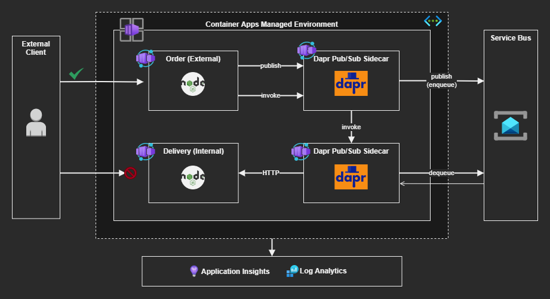

# Azure Container Apps

Serverless micro-services on Azure with Container Apps with Dapr integration.

As per Microsoft [documentation](https://learn.microsoft.com/en-us/azure/container-apps/connect-apps?tabs=bash) on networking for Container Apps:

> When you call another container in the same environment using the FQDN, the network traffic never leaves the environment.



## Deploy

Register these providers if they have never been used:

```sh
az provider register --namespace Microsoft.App
az provider register --namespace Microsoft.OperationalInsights
```

Simply run the following to start the environment:

```sh
cd infra

touch .auto.tfvars

terraform init
terraform apply -auto-approve
```

Testing from external:

```sh
curl "https://<containerapp-orders-fqdn>/liveness"
```

Or testing from within the container directly to the sidecar:

```sh
curl -d '{"orderId":"ORD-00001"}' -H "Content-Type: application/json" -X POST "<containerapp-orders-fqdn>/api/orders"
```


## Self-Hosted Dapr

Create 

```sh
az group create -n "rg-containerapps-dev" -l "eastus"
az monitor log-analytics workspace create -g "rg-containerapps-dev" -n "log-containerapps-dev" -l "eastus"
az monitor app-insights component create --app "appi-containerapps-dev" -g "rg-containerapps-dev" --workspace "log-containerapps-dev" -l "eastus"
az monitor app-insights component show --app "appi-containerapps-dev" -g "rg-containerapps-dev" --query "connectionString" -o tsv
```

Start the services:

```sh
# Start RabbitMQ
docker run -d -p 5672:5672 --name dtc-rabbitmq rabbitmq

cd delivery

# Delivery
dapr run \
  --app-id delivery \
  --app-port 3100 \
  --app-protocol http \
  --dapr-http-port 3501 \
  --components-path ../components \
  npm run dev

cd orders

# Orders Dapr
dapr run \
  --app-id order \
  --app-port 3000 \
  --app-protocol http \
  --dapr-http-port 3500 \
  --components-path ../components \
  npm run dev
```

To test it, send a message to the queue:

```sh
curl -d '{"orderId":"ORD-00001"}' -H "Content-Type: application/json" -X POST "http://localhost:3000/api/orders"
```

Publishing directly to the topic:

```sh
dapr publish --publish-app-id order --pubsub order-pub-sub --topic orders --data '{"orderId": "100"}'
```

## Docker commands


To publish container changes:

```sh
cd services

docker build ./order -t epomatti/azure-containerapps-order
docker build ./delivery -t epomatti/azure-containerapps-delivery

docker login --username=<username>

docker push epomatti/azure-containerapps-order
docker push epomatti/azure-containerapps-delivery
```

## Clean-up

```sh
terraform destroy -auto-approve
```

## References

- [Container Apps Dapr ports](https://github.com/microsoft/azure-container-apps/issues/189)
- [Container Apps REST API - Container Apps](https://learn.microsoft.com/en-us/rest/api/containerapps/container-apps/create-or-update?tabs=HTTP)
- [Container Apps REST API - Managed Environments](https://learn.microsoft.com/en-us/rest/api/containerapps/managed-environments/create-or-update?tabs=HTTP)
- [Dapr Service Bus](https://docs.dapr.io/reference/components-reference/supported-pubsub/setup-azure-servicebus/)
- [Dapr Pub/Sub](https://docs.dapr.io/developing-applications/building-blocks/pubsub/howto-publish-subscribe/)
- [Microservices with Dapr using the CLI](https://learn.microsoft.com/en-us/azure/container-apps/microservices-dapr?tabs=bash)
- [Microsoft Tech Community Article - Terraform](https://techcommunity.microsoft.com/t5/fasttrack-for-azure/can-i-create-an-azure-container-apps-in-terraform-yes-you-can/ba-p/3570694)
- [Terraform Article](https://www.thorsten-hans.com/deploy-azure-container-apps-with-terraform/)
